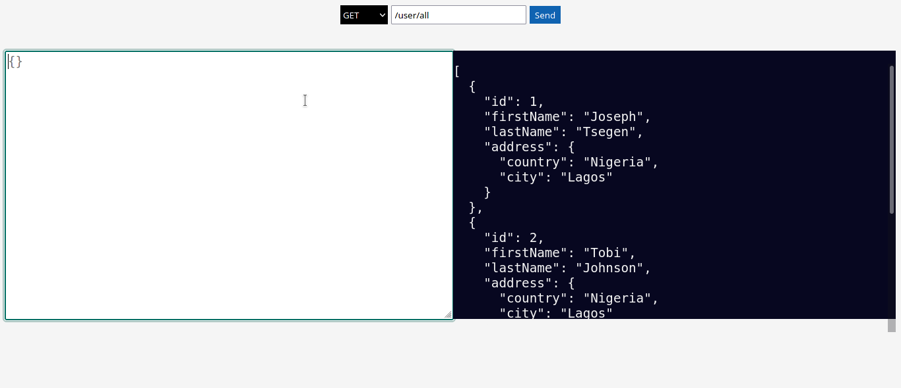

# Overview

This is a test api that carries out crud operation on a mock data.

# To run the environment

```
yarn install
```

```
yarn dev
```

```
# listening on http://localhost:3000
```

# To test the api

I have made a front end to test the api. Simply just go to localhost:3000 on your browser
and you should see this page:



# How to run queries

- Since the frontend is on rendered on the server you can user relative url paths to make queries
  an example of this is inputing `user/all` in the input field and making a get request.

- You can also use absolute path to run queries e.g using `http://localhost:3000/user/all` and making a get request.

# Url paths

- `user/all` => to get all users
- `user/:id` => to get a user e.g `user/1` to get a user with id 1
- `user/new` => to add a new user
- `user/update/:id` => to update a user e.g `user/update/1` to update a user with id 1
- `user/delete/:id` => to delete a user e.g `user/delete/1` to delete a user with id 1

# Getting all users

To get all users simply

```
GET /user/all
```

and that a should return an array of users.

# Getting a single user

To get a single user simply make a get request to `/user/:id` with :id being the id of the user

```
GET /user/1
```

# Adding a new user

To add a new user, first you have to make a post request to `/user/new/` and send the
data of the new user in an object called newUser.

example,

```
POST /user/new
// in the textarea in the api tester(frontend) (all data are to be sent in json format)
{  "newUser": {
  "id": 4,
  "firstName": "kyle",
  "lastName": "cook",
  "address" {
    "country": "USA",
    "city": "Nabraska"
          }
     }
  }

  // response if successful
  { message: "user successfully added"}
```

# To update a user

send a put request to `user/update/:id` the :id being the id of the user you want to update
and send an object containing the fields/properties of the user you want to update.
example

```
PUT /user/update/1
// in the text area of the api tester(frontend) (all data are to be sent in json format)
{
  "firstName": "John",
  "lastName": "Makinde"
}

// response if successful
{message: "Successfully updated user"}

```

# To delete a user

send a delete request to `user/delete/:id` the :id being the id of the user you want to delete from the mock data.

```
DELETE user/delete/1

// response if successful
{message: "successfully deleted user with id of 1"}
```
