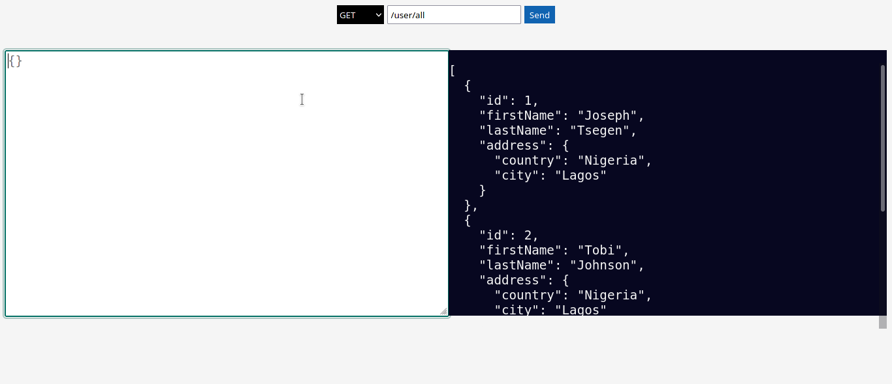

# Overview

This is a test api that carries out crud operation on a mock data.

# To run the environment

```
yarn install
```

```
yarn dev
```

```
# listening on http://127.0.0.1:8080
```

# To test the api

I have made a front end to test the api. Simply just go to localhost:8080 on your computer
and you should see this page:

ds

# How to run queries

- Since the frontend is on rendered on the server you can user relative url paths to make queries
  an example of this is inputing `user/all` in the input field and making a get request.

- You can also use absolute path to run queries e.g using `http://localhost:8080/user/all` and making a get request.
